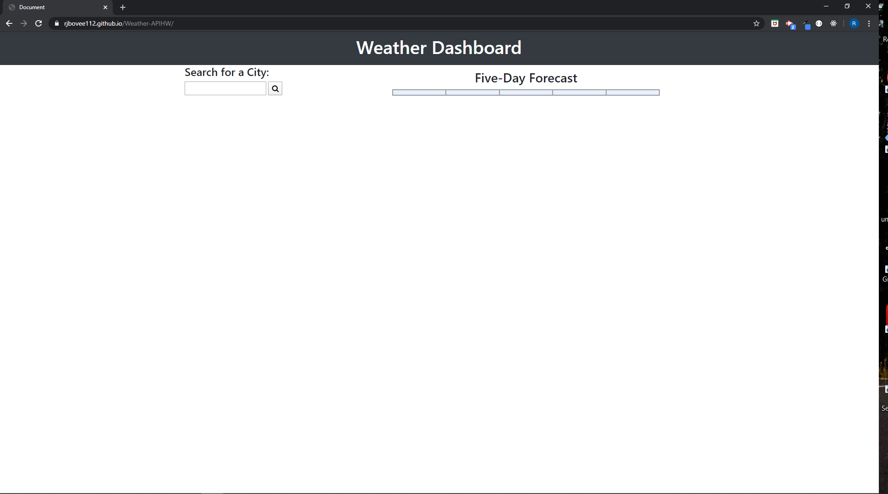
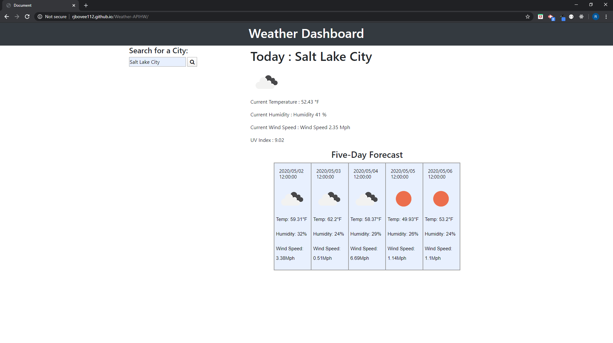

# Unit 06 Server-Side APIs Homework: Weather Dashboard

Developers are often tasked with retrieving data from another application's API and using it in the context of their own. Third-party APIs allow developers to access their data and functionality by making requests with specific parameters to a URL. In this homework assignment, your challenge is to build a weather dashboard using the OpenWeather API.

## Instructions

Build a weather dashboard application with search functionality to find current weather conditions and the future weather outlook for multiple cities. Following the [common templates for user stories](https://en.wikipedia.org/wiki/User_story#Common_templates), we can frame this challenge as follows:

How do you deliver this? Here are some guidelines:

* Use the [OpenWeather API](https://openweathermap.org/api) to retrieve weather data for cities. The documentation includes a section called "How to start" that will provide basic setup and usage instructions.

* Use AJAX to hook into the API to retrieve data in JSON format.

* Your app will run in the browser and feature dynamically updated HTML and CSS powered by jQuery.

* Display the following under current weather conditions:

  * City

  * Date

  * Icon image (visual representation of weather conditions)

  * Temperature

  * Humidity

  * Wind speed

  * UV index

* Include a search history so that users can access their past search terms. Clicking on the city name should perform a new search that returns current and future conditions for that city. 

* Include a 5-Day Forecast below the current weather conditions. Each day for the 5-Day Forecast should display the following:

  * Date

  * Icon image (visual representation of weather conditions)

  * Temperature

  * Humidity

## Minimum Requirements

* Functional, deployed application.

* GitHub repository with a unique name and a README describing the project.

* User can search for weather reports by city using the openweathermap API.

* After searching for a city, the following information is displayed:

  *  Current temperature

  *  Current humidity

  *  Windspeed

  *  Uv index

  *  5 day forecast

* Application uses icons to represent weather conditions.

* Application stores previously searched for cities in localstorage and displays them to the user.

* Application loads last searched city forecast on page load.

## TECH USED

* HTML
* CSS
* JSON
* AJAX
* jQuery
* Server-side APIs
* Bootstrap
* JavaScript

## ON LOAD 

## FIRST ENTRY

## HOW TO USE 

​Type in a cities name in the search bar and click search. On the right side of the screen you will see the current weather and  underneath that you will see the five day forecast. After you click search, a button will appear on the left side of the screen underneath the search bar with the name of the city that you just searched for. When you click on that button the right side of the screen will populate the weather information for that city. When you search for a new city the search button will generate a new history button underneath the search bar, and the old search button will move down a level. Everytime you search for a new city the same process will take place.

## CREATED BY

This weather was created by Robert Bovee

This link will open the Weather API

https://rjbovee112.github.io/Weather-APIHW/

